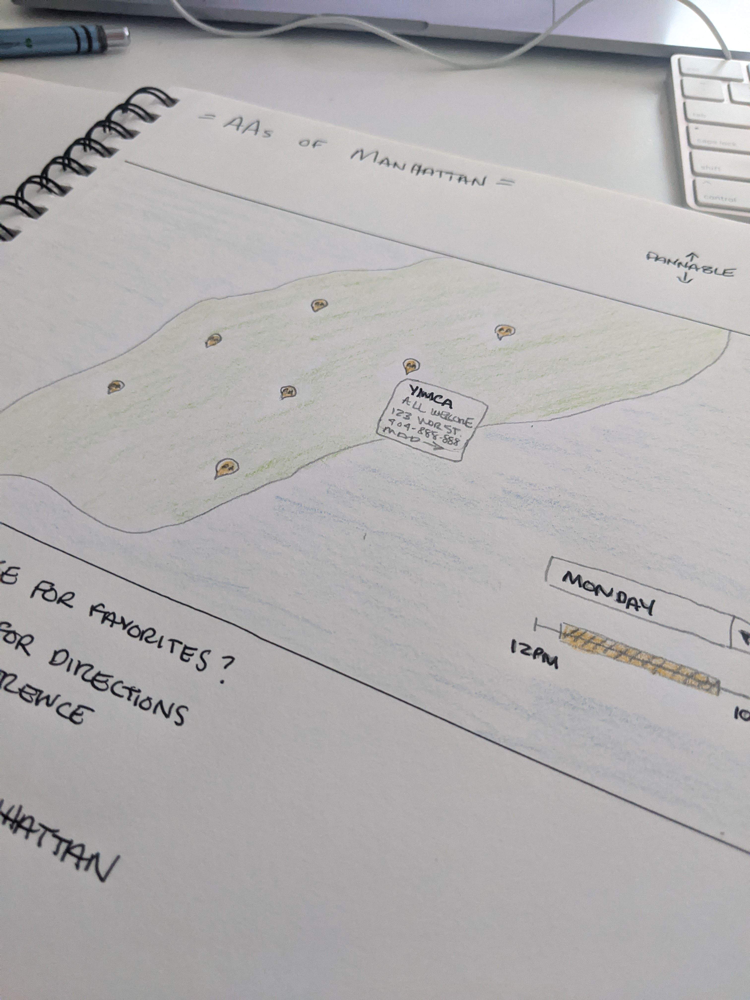
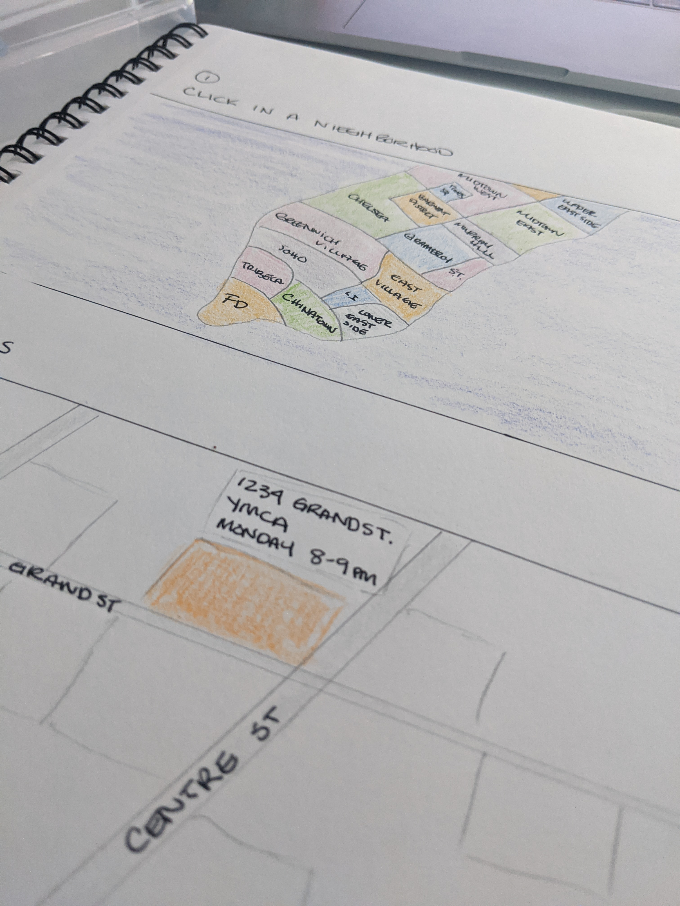
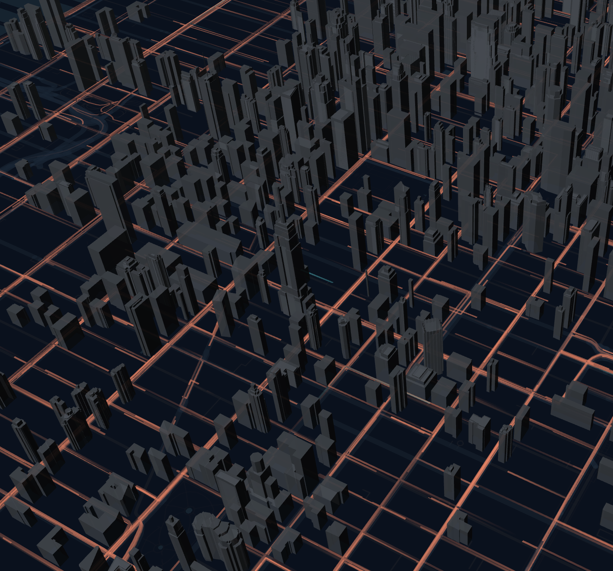
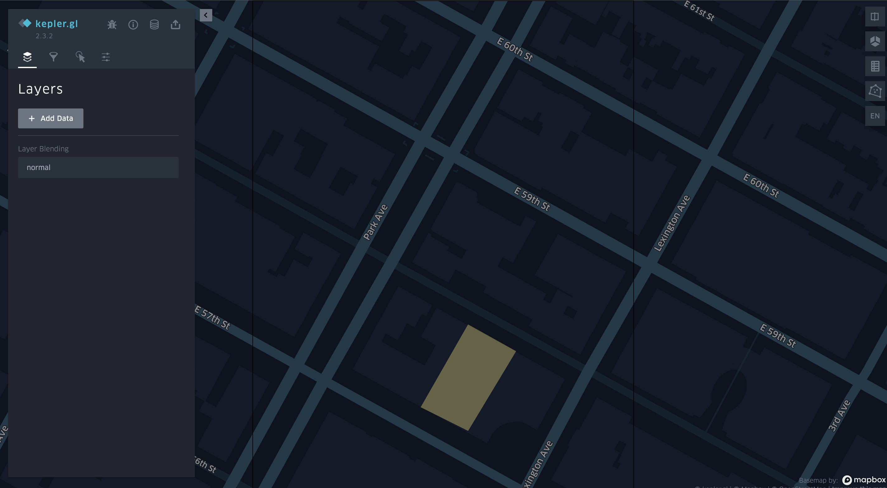
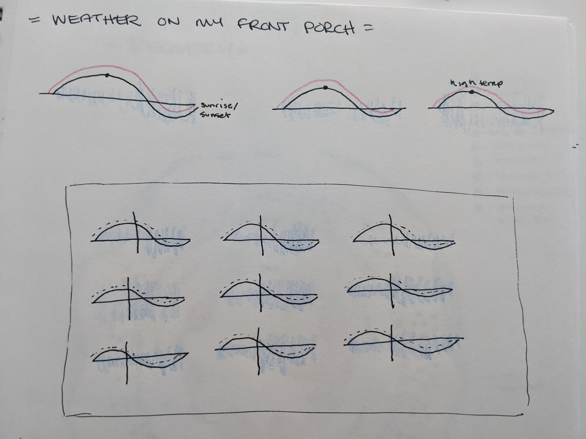

## Week 10: Interface Designs

# Project 1: AA Map

I wanted to focus on the user and approach this one from a UX perspective. Therefore, I asked questions about how can the user find what they need as quickly as possible. Because the instructions for this assignment indicated that it would be using Leafletjs, I sketched a fairly basic idea of what a Leaflet implimentation might look like.

<b>Basic design</b>
 

 
This design features:
- pins for location sites
- hoverable tooltips with address, phone, and meeting time information
- max-zoom on the map to prevent zooming out to the whole world
- finding an interesting tile layer, maybe a grayscale version or creamy design
- can I only include Manhattan and hide everything on either side? This could probably be done with a combination of D3js and Leaflet.

<b>UX Concerns</b>
 
This isn't a truly "exploratory" visualization in that it may prompt a user to explore for a location but once they find what they are seeking, they will move on. In this way, it is different from an "exploratory" visualization that might be used for storytelling purposes where the design is meant to draw users deeper into the experience. Because of this, thinking about the user experience is critical to the success. Users:
- want to quickly find address of location
- may be looking for a location they have been to before
- have tools they know (dropdowns, sliders, panning, zooming) rather than tools/interface they have to learn

 
<b>Drill-down By Neighborhood</b>
 
Thinking more about the user, I thought it might be useful to allow the user to navigate to a starting point. This could be done by listing the neighborhoods in a dropdown, or by proving the users a start overlay on the map with which they can choose their neighborhoods. This may be helpful to instantly narrow their choices. Some drawbacks of this are:
- extra click for users
- user may want to search several neighborhoods

 
Can we use a library other than Leaflet? Mapbox, Kepler, Deckgl...
 
<b>Deckgl</b> - I don't know if this is possible in the layers, but it would be really neat to add a layer of color for the location of the building.
 

<b>Kepler</b> - here is a mockup of how that might look in kepler. The yellow square indicates the location of the building. I don't know if this can be built, if the building layer data exists in a reliable way, but it was something I wanted to mockup and explore.
  

<b>Answers</b>
 
- interactions include panning, zooming, hovering, drilling down, filtering, and possibly saving favorites to local storage
- geographic locations to the map using coordinates
- coordinates can be used directly in Leaflet in order to plot pin points. The data would be exported as a json and used locally. It would likely be a static file unless the assignment calls for something dynamic.
- map of lower Manhattan that is pannable
- See above UX portion. In addition to that, I assume the user is likely using a mobile phone. Mobile first design is important.

# Project 2: Recovery Blog

Intitally for this project I wanted to write a daily poem, my first assignment with Dynamo included 3 such poems. I have an additional 10 poems, which I continued to collect since I enjoyed that writing process. However, because of a personal health issue, I decided to change this project from being poetry to being a visualization of my health issue from pre to post surgery notes, with fields including pain level, mood, and pills taken (which was an insane amount when I go back and look at the data!)

To reiterate, the fields include date, pain level, mood, and various medicines taken (through IV and orally) for the 1.5 months from just before surgery, when I was taken as much as 30mg of Oxycodone per day, to a month after surgey, where I was recovering from the pain and intensity of the operation as well as coming down from being on narcotics daily for almost four months.

<b>The Idea</b>
 
Ideally this would be an illustrator visualization, but I will be attempting to build it using Javascript (yikes!). I was inspired by the way Nadieh Bremer often layers data in circular visualizations. My visualization will show four layers: pain, date, pills, and mood.
 

<b>Answers</b>
 
- tooltips are the only interaction
- data will be mapped into line graphs and area charts that are curved into a layered ring. Pill numbers will be color coded and grouped by date. The circle represents days from Oct 1 - Nov 7.
- The first task is to figure out how to map the dates (which will need to be formmatted on output) into a circle. Once I know where the coordinates are (I am thinking I will need pythagorian therom to get the math right), I can layer the circles outward and place the line graph on an x axis.
- As seen in the picture
- Ideally I would like this to be a poster type visualization, but because its data structures my challenge will be able to make this nice looking on all device widths. My assumption about the user is that they will want to zoom and pan to see details.

# Project 3: Weather Sensor

I haven't recieved the magnetic field sensor yet so I am using the temperature/humidity gauge.

For the visualization, I want to create a collection of multiples. Each individual graph will be a day, from sun up to the following day sun up. The sunrise/sunset information will be collected by another data source specifically using my zip code. The blue indicates the level of humidity for that day. I would like to reduce the number of items in the graphs to the bare minimum, meaning I want to remove the axises and lines and any other chart pieces, in order to experiement with just how minimal the design can get and still have meaning.
 

This collection of multiples will have interaction, similiar to that found on fivethirtyeight: <a href="https://projects.fivethirtyeight.com/trump-approval-ratings/">https://projects.fivethirtyeight.com/trump-approval-ratings/</a>. Hovering one of the maps will show the same time for all of the days. My hypothesis of how this will look is that it will show shorter, colder days when hovered in a group.

<b>Answers</b>
 
- interactive as mentioned above
- for the curved, I want to use a D3 interpolate to create nice arc. I am assuming that the temperature will start low, get to a high, and go low again. If I see a different pattern, I want to make sure that is rendered in the visualization. The dashed (or red) line will show the heat index, though in the winter that's not as interesting as the summer.
- Temp, humidity, and heat index are being recorded. I will be pulling this information into a static file, unless live data is required. The time will require some manipulation in the front end to show correctly.
- default view will be all maps with no selected value. The typography and header position are yet to be determined.
- desktop or mobile layout, achievable with fluid containers. User will be able to understand and deduce interesting observations about the change of seasons by manipulating the slider.

