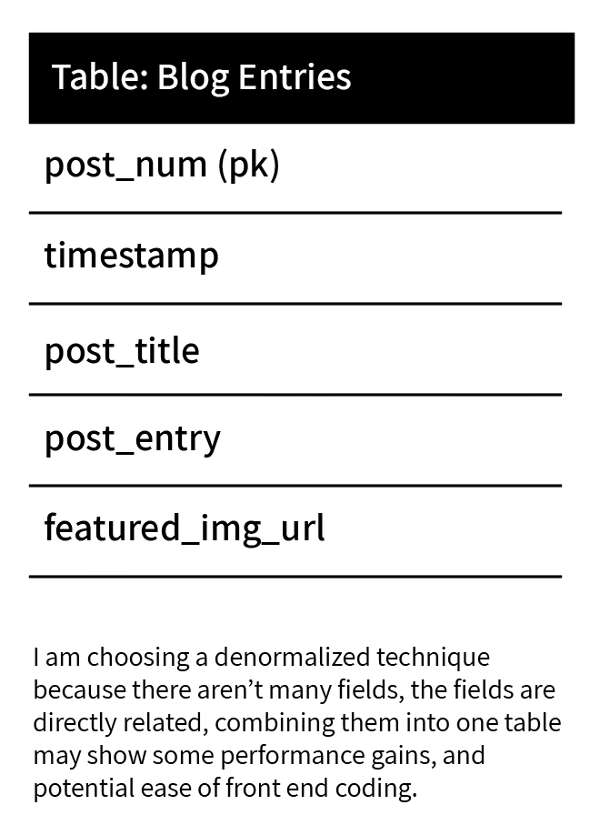
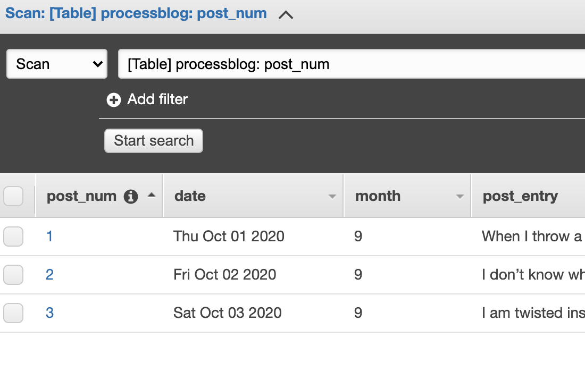

## Week 5: Dynamodb

## Coming back to Cloud9
Since the second week of class, I have been using a local instance but for this week
I decided to go back to Cloud9 in order to keep the permissions correct when
writing to the dynamodb. <br><br>

## Content
For my blog content, I wrote a short poem everyday about something that was on my mind.
I decided to incude this as string (HTML) so that I could dictate the line breaks. I created a reusable class, per the assignment which will be passed the elements as parameters to create an object to be sent to the table.<br>

```
class BlogEntry {
  constructor(postNum, date, postTitle, postEntry) {
    this.post_num = {};
    this.post_num.N = postNum.toString();
    this.date = {}; 
    this.date.S = new Date(date).toDateString();
    this.post_title = {};
    this.post_title.S = postTitle;
    this.post_entry = {};
    this.post_entry.S = postEntry;
    this.month = {};
    this.month.N = new Date(date).getMonth().toString();
  }
}
```
<br><br>

## Destructured Database
I went with a destructered database because I believe it is the most optimal.
Also, there isn't much data and the data seems to go together so I didn't
see the need to overengineer this db at this point. As you can see from the picture, initially I wanted a image but ended up removing that since I didn't have any images ready to go.<br>

<br><br>

## Setting permissions
I set permissions using IAM in AWS. This was a great way to learn since it seems like
the safest way to protect the credits on my account. The IAM was readily available when I went into Cloud9 to change permissions.<br><br>

## Looping using Async
I used async in order to loop through each of the the blogEntries which were created from the BlogEntry class and pushed onto the blogEntries array. One note about this was that it took some playing around with the code to get it right. You can see I used "next" instead of callback, inline with some other middleware libraries in node.js.<br>

```
async.eachSeries(blogEntries, function(value, next) {
  var params = {};
  params.Item = value; 
  params.TableName = "processblog";
  
  dynamodb.putItem(params, function (err, data) {
    if (err) console.log(err, err.stack); // an error occurred
    else     console.log(data);           // successful response
    next();
  });
});
```
<br><br>

## Testing
I tested the site, and it tooks some trial and error, however all three posts 
are showing in the db:<br />

