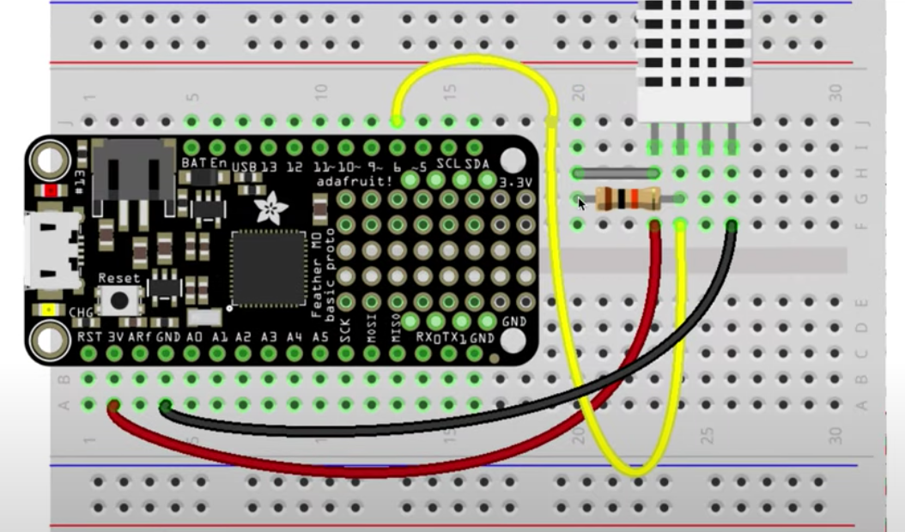
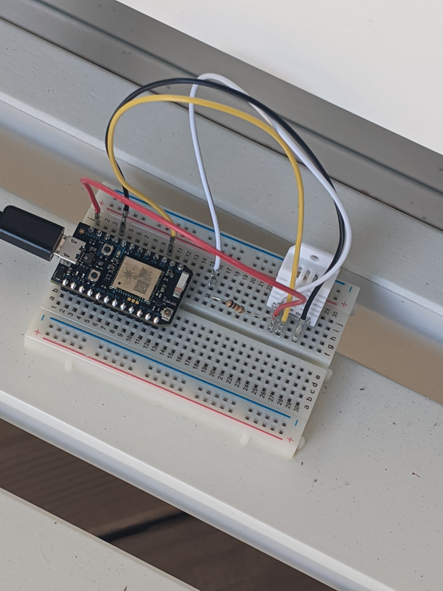

## Week 8 & 9: Particle Photon Temperature Sensor

<b>Overview</b><br>
Assignment 8 & 9 were used to hook up a Photon controller and connect it to a data source.

## Assembling the Component

<b>What I purchased</b>
- Breadboard
- Photon WiFi Chip
- Wires
- Temperature/Humidity Sensor
- Cable for power

<b>Assembly</b>
Each portion of the breadboard has particular metal strips that can be used to complete circuts, so the position of each part is important. One note, you have to push down fairly hard to get some of the pieces installed.



Using setup.particle.io, I followed the instructions to set up the Photon. This was a simple wizard for getting the device online. The device "breathes" <span style="color: cyan">cyan</span> when it gets online.

I set my device on the front porch. I am a little worried about the humidity in our area destroying the board, but so far, no problems except for the occasional spider.



## Setting up the Particle Code

To set up the code I went to <a href="http://build.particle.io/">the particle IDE</a> to set up the code.

Two functions:
- ```void setup() {}``` - to setup the device in the code.
- ```void loop() {}``` - to continuously loop through and update the values.

The benefit of using Adafruit is that, not only is it a woman owned business but it also has a nice template ready to go for this project. To access it in the particle IDE go to: Libraries > (DHT22 - sensor) > ADAFRUIT_DHT_PARTICLE > dht-test.io and click on "Use this example". This template gets us going with prebuilt code in the particle IDE. 

NOTE: ```DHTPIN 02``` refers to the pin being used.

I added three values to record in this file:<br />
```
double tempF = 0;
double humidity = 0;
double heatIndex = 0;
```
Clicking on the lightening bolt in the far right menu at the top will send this code to the Photon. The progress bar at the bottom allows you see the update of the device. When done with the operation, the device goes back to breathing cyan.

<a href="http://console.particle.io">http://console.particle.io</a> allows you to monitor the connection of the Photon and get readings. The communication happens from your WiFi to particle.

## Particle API results
To get the results programatically, we need to use the particle API which is formatted as follows: ```https://api.particle.io/v1/devices/[DEVICE_ID]/temp?access_token=[TOKEN_ID]```

- The device id can be found in the particle console.
- "temp" can be replaced in my string with "humidity" or "heatIndex" since I set up multiple variables.
- We had to install the particle client (particle CLI) in Cloud9. This CLI is available on the particle website. The CLI will allow us to get an access token: ```bash <( curl -sl https://particle.io/install-cli )```

Once the CLI is installed, you can run the following to get an access token: ```particle token create``` 

NOTE: This API url will only work if the device is plugged in.

## Create Table for Results

```wa09.js```

The code here had two module requirements: ```pg``` for the postgres database and ```dotenv``` for storing the environment variables which include credentials for accessing the pg db.

We are using our existing db for AA in order to save a dollar per day from AWS. Assignment 4 was a great help since all of these env vars were set up there already.

We started out by creating a new table using a SQL statement. I modified this SQL in order to include <b>sensorTemp</b>, <b>sensorHum</b>, and <b>sensorHI</b>. I also created a column for <b>sensorTime</b>.<br />
```var thisQuery = "CREATE TABLE sensorData ( sensorTemp double precision, sensorHum double precision, sensorHI double precision, sensorTime timestamp DEFAULT current_timestamp );";
```
I had to drop and recreate this table a couple of times to get it correct. I used the DROP statement, but also ended up installing pgAdmin as a way to monitor my progress in a GUI-er application.

## Inserting Results into the Table

```week9worker.js```

This is the powerhorse file of the application. I am using ```fetch``` for making the request from the API, ```pg```, and ```dotenv```.

For the environment variables, I identified the device_id and access_token separately so that they would not be published.

I chose to use fetch instead of ```request``` because I had multiple variables to loop through rather than just one. 

To handle the multiple variables, I put them in an array:<br />
```var particle_var_array = ['temp', 'humidity', 'heatIndex'];```

I used ```async``` and ```await``` in order to set up my promise structure in the code, following the latest javascript fetch patterns.<br />
```var getAndWriteData = async function() {

    var sensorVals = [];
    
    for (var particle_variable of particle_var_array) {      
        var device_url = 'https://api.particle.io/v1/devices/' + device_id + '/' + particle_variable + '?access_token=' + access_token;
        var res = await fetch(device_url);
        var json = await res.json();
        sensorVals.push(json.result);
    }
}
```

This allowed me to form a string called ```thisQuery``` where I could concatenate all of the variables into one ```INSERT``` statement.
```var thisQuery = "INSERT INTO sensorData VALUES (" + sensorVals.join(',') + ", DEFAULT);";```

One thing that was a little strange is that I noticed the ```INSERT``` is reliant on order. Meaning it doesn't have an indicator of which value goes into which column, rather it seems to insert the values based on how they are ordered in the ```INSERT``` statement.

## Running on an External Server
In order to constantly ping the device, we set up a pm2 server. The commands used were:

```pm2 start / stop``` to start and stop the collection of data
```pm2 list``` to find out information about when the server last collected data from the device

## Checking Data
```week9checks.js```

In order to check on the status of collection, Aaron suggested we create a executable file with a ```SELECT``` statement to return the rows.

We used ```console.table``` in order to format the results in the terminal. We used three queries:

```var thisQuery = "SELECT * FROM sensorData;";
var secondQuery = "SELECT COUNT (*) FROM sensorData;";
var thirdQuery = "SELECT sensorTemp, COUNT (*) FROM sensorData GROUP BY sensorTemp;";
```

This allowed us to see the data in the table as well as how many rows had been written. We ran this to ensure that the number continued to increase.

This was great in the terminal, however, I continue to prefer to use <b>pgAdmin</b> to look at the results.

